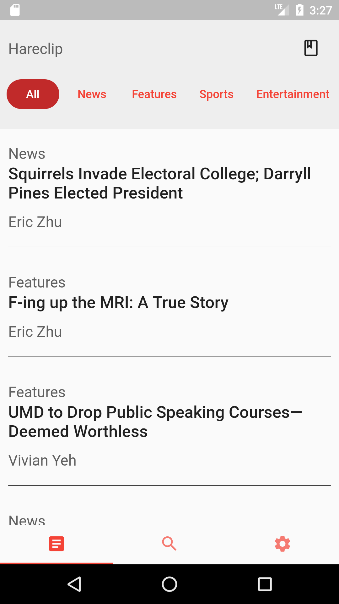

<h1 style="display: flex; align-items: center;">
   Hareclip
</h1>

Mobile reader for the Hare satire newspaper

Home                           | Article
:-----------------------------:|:-------------------------:
 | 

## Getting Started

### Prerequisites
- Android Studio
- Android SDK
- Java SE 11
- Flutter
- Running [Imaginary](https://github.com/h2non/imaginary) deployment

Create `.env` from `sample.env` and insert proper credentials.

### Debug in VSCode

Start mobile emulator of choice and run ```Run -> Start Debugging``` in VSCode

## Bundling for Release

Follow Flutter [release instructions](https://flutter.dev/docs/deployment/android)
